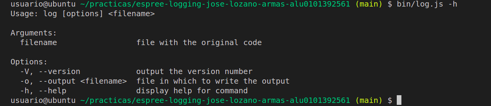
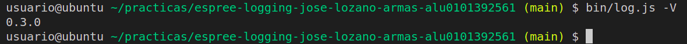
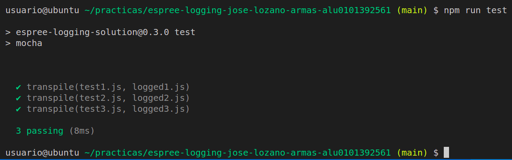
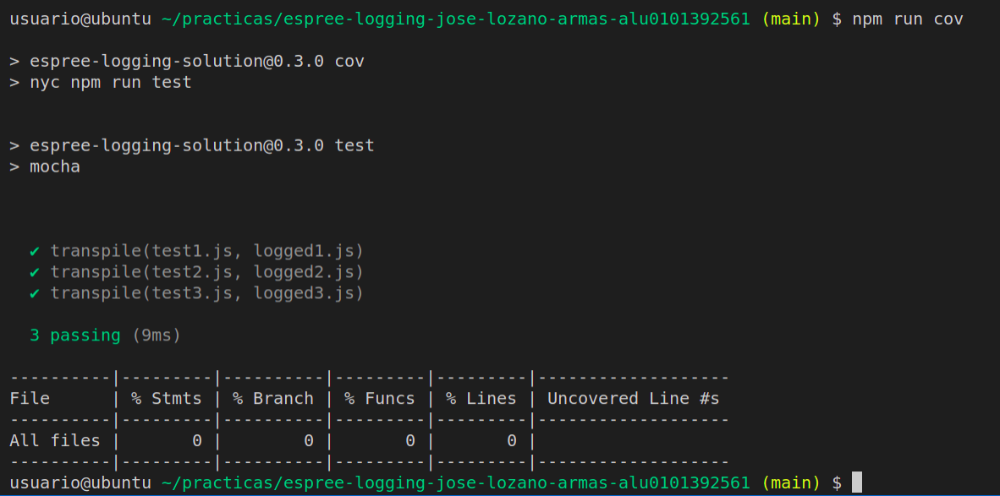

[](https://classroom.github.com/open-in-codespaces?assignment_repo_id=10276738)
# Práctica Espree logging

## Resumen de lo aprendido
Gracias a este práctica he podido aprender a usar espree, una librería que proporciona funciones que sirve de cara a la traducción de árboles. Usando métodos cómo por ejemplo traverse, el cual permite entrar en dicho árbol, o parse, que permite la propia traducción del mismo. Al mismo tiempo he aprendido otros conceptos nuevos cómo puede ser publicar un paquete a través de NPM. Aparte de repasar conceptos anteriores cómo testing, coverage, integración continua, etc...
...

## Indicar los valores de los argumentos

Se ha modificado el código de `logging-espree.js` para que el log también indique los valores de los argumentos que se pasaron a la función. 
Ejemplo:

```javascript
function foo(a, b) {
  var x = 'blah';
  var y = (function (z) {
    return z+3;
  })(2);
}
foo(1, 'wut', 3);
```

```javascript
function foo(a, b) {
    console.log(`Entering foo(${ a }, ${ b })`);
    var x = 'blah';
    var y = function (z) {
        console.log(`Entering <anonymous function>(${ z })`);
        return z + 3;
    }(2);
}
foo(1, 'wut', 3);
```

## CLI con [Commander.js](https://www.npmjs.com/package/commander)

A continuación usaré este apartado para resaltar el hecho de haber utilizado commander. Con este herramienta la cual se ha generado usando el siguiente código:

```javascript
#!/usr/bin/env node

import { program } from "commander";
import { createRequire } from "module";
const require = createRequire(import.meta.url);
const { version } = require("../package.json");
import { transpile } from "../src/logging-espree.js";

program
  .version(version)
  .argument("<filename>", 'file with the original code')
  .option("-o, --output <filename>", "file in which to write the output")
  .action((filename, options) => {
    transpile(filename, options.output);
  });
program.parse(process.argv);
```
Se puede llegar a activar algunas opciones para complementar al programa principal.

*Opción -h:* 
Esta opción sirve para ver que posibles acciones puede tomar el programa, tal y cómo se ve en la siguiente captura:


*Opción -V:* 
Esta opción se usa para devolver la versión del programa tal cómo se puede ver en la siguiente captura:


## Reto 1: Soportar funciones flecha
El siguiente apartado es para evidenciar el hecho de haber superado el reto de añadir funciones flecha al programa. Para conseguir esto usé el siguiente código:
```javascript
import * as escodegen from "escodegen";
import * as espree from "espree";
import * as estraverse from "estraverse";
import * as fs from "fs/promises";

/**
 * Función que recibe el fichero y tras traducirlo lo vota a la salida
 * @param {*} inputFile Fichero de entrada
 * @param {*} outputFile Fichero de salida
 * @returns El programa del fichero de entrada traducido
 */
export async function transpile(inputFile, outputFile) {
  let input = await fs.readFile(inputFile, 'utf-8'); /// Leemos el fichero y le ponemos formato utf-8
  let output = addLogging(input); /// Guardamos el código traducido
  if (outputFile === undefined) {
    console.log(output);
    return;
  }
  await fs.writeFile(outputFile, output);
}

/**
 * Función que parsea el árbol
 * @param {*} code Código a traducir
 * @return El código traducido
 */
export function addLogging(code) {
  var ast = espree.parse(code, {ecmaVersion: 12, loc: true});
  estraverse.traverse(ast, { /// Con traverse nos metemos en el árbol y buscamos que tipo de node es
    enter: function(node, parent) {
      if (node.type === 'FunctionDeclaration' ||
          node.type === 'ArrowFunctionExpression' ||
          node.type === 'FunctionExpression') {
            addBeforeCode(node);
          }
      }
    });
  return escodegen.generate(ast); /// Generamos el ast usando escodegen
}

/**
 * @desc Función que recibe un código y lo módifica acorde al árbol de espree
 * @param {*} node Mensaje a inprimir
 */
function addBeforeCode(node) {
  const name = node.id ? node.id.name : '<anonymous function>'; // Se guarda si se tiene id o es una función anónima
  let paramNames = ""; // Variable que irá guardando los nombres de los parámetros (array)
  if (node.params.length) { 
    paramNames = "${" + node.params.map(param => param.name).join("}, ${") + "}"; /// Generamos un array con los nombres de los parámetros
  }
  const lineN = node.loc.start.line;
  const beforeCode = "console.log('Entering " + name + "(" + paramNames + ") at line " + lineN + "');"
  const beforeNodes = espree.parse(beforeCode, { ecmaVersion: 12}).body;
  node.body.body = beforeNodes.concat(node.body.body); /// Actualizamos el nuevo body del árbol
}
```
Este código explicado de manera resumida cuenta con 3 funciones.

*Función transpile:* 
El objetivo de esta función es muy simple. La función transpile recibe un fichero de entrada y otro de salida. Lee el fichero de entrada, el cual procesa baja el estandar de utf-8 y es enviado a la función addLogging, la cual se explicará más adelante y luego simplemente se imprime en el fichero de salida especificado para la misma

*Función addLogging:*
Está función recibe un código y lo que es llamar a espree para traducirlo. Espree llama a parse para activar su traducción que en este caso se pasa a ecmaVersion 12, para luego mediante el método traverse introducirse en el árbol y analizar el tipo de función que se está buscando.

Es en este apartado donde podemos ver la búsquedas de las Arrow Functions y de cómo este las analiza pasandoselas a la función addBeforeCode, para que esta actue en base a lo que explicaremos más adelante y luego retorne el árbol de generación que nos da escodegen.

## Reto 2: Añadir el número de línea

*Función addBeforeCode:* 
Partiendo del código anterior solo nos queda por mencionar addBeforeCode, es en esta función donde se añade el contar la línea.

Cómo vemos en la función lo que se hace es distinguir entre una función con id, o una función anónima (arrow function) y se declara una variable la cual se usará para almacenar los nombres de las mismas.

Seguido a esto se muestran una serie de variables que lo que hacen es intersectar los distintos nombres que se almacenaron anteriormente, para luego imprimirlos junto con su número de línea. Para que toda esa información sea trasmitida a la anteriormente mencionada addLogging

## Tests and Covering
De cara a los test existen una serie de scripts para ejecutar los mismos tal y cómo se puede ver en el siguiente ejemplo:


Así mismo también se ha hecho un estudio encubierto de las pruebas:
